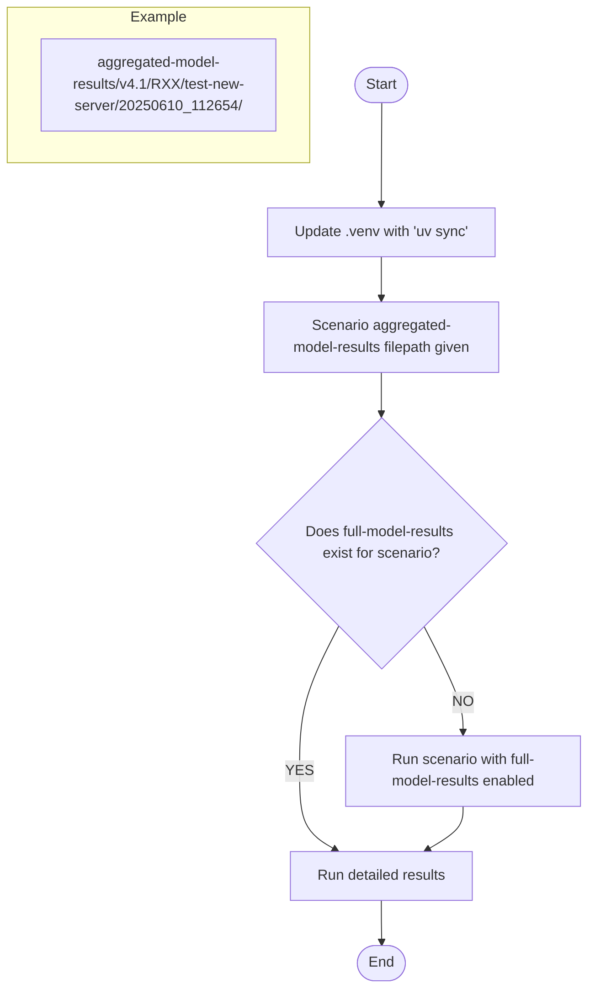

# NHP Products

This repository contains the Python code for generating various data science
products and outputs, to support use and development of the NHP model. It is
primarily for internal use, although we are sharing the code openly.

It is currently split into two main types of scripts: PRODUCTS and QA. We are
currently using Jupyter notebooks, although we are working to move away from
this.

Where functions are reusable across scripts, they have been extracted into the
`nhpy` package, which we also hope to split out into its own repo in future. The
`nhpy` package is for accessing, working with, and processing parameters, data,
and results files from the NHP model using Python.

For many of the scripts to work, you will need environment variables in a `.env`
file from a member of the Data Science team. The variables required are listed
in `SAMPLE.env`.

## Using this repository

We use `uv` for dependency management in this repository. The instructions in
this README will assume that you have this installed.

Scripts are likely to run faster if you are _not_ connected to the VPN.

## Utilities

### Check full results

This module checks if full model results exists for a specific scenario. Full
model results are required for the detailed results and detailed activity
avoided products. Check the `nhpy.check_full_results` module docstring for
usage.

### Run scenario with full results

This module takes the parameters file from an already completed model run, does
minor edits, and resubmits the params to the model API, this time with
`save_full_model_results` set to `True`. Check the `nhpy.run_full_results`
module docstring for usage.

## Pipeline

The `nhpy/pipeline.py` module streamlines generating detailed NHP model results
by integrating multiple functionalities into a single pipeline that handles
dependency installation, result verification, and processing. Successfully
tested with the following use cases:

- Results path that does not exist
- Results path that already has full results
- Results path that does not have full results

Usage:

```bash
# Basic usage, saves to `nhpy/data`
uv run python -m nhpy.pipeline aggregated-model-results/v4.x/RXX/test/20250101_100000/
# save to selected path
uv run python -m nhpy.pipeline aggregated-model-results/v4.x/RXX/test/20250101_100000/ -o <results_path>
```



## Products

We have a number of products that are available on request. These are:

### Time profiles

Jupyter notebook in `notebooks/PRODUCT_time-profiles`, used to create the time
profiles for specific scenarios, using
[this methodology](https://connect.strategyunitwm.nhs.uk/nhp/project_information/user_guide/glossary.html#time-profiles).

### Detailed results

Jupyter notebook in `notebooks/PRODUCT_detailed_results`, used for converting
NHP model results into a format more suitable for conversion to capacity.
Scenario must have "full model results" for the notebook to work.

### Detailed activity avoided

Notebooks in `notebooks/PRODUCT_detailed_activity-avoided`.

- `national_activity_avoided` Databricks notebook was used to produce outputs
  feeding in to the calculation of cost savings from activity mitigation on a
  national level. Further details on this work to follow, when it is published.
- `detailed_activity-avoided` Jupyter notebook is a proof of concept and not
  currently in use, or kept updated. It is being kept in this repository so it
  can be built upon in future.
  [Further work on this is being planned](https://github.com/The-Strategy-Unit/nhp_planning/issues/162).

## Quality Assurance (QA)

These scripts are run on every model release, as part of the
[QA process](https://github.com/orgs/The-Strategy-Unit/projects/6).

### Detailed baseline

Jupyter notebook in `notebooks/QA_detailed-baseline` for generating more
detailed aggregations of the baseline data, which are used by users of the model
to reconcile model data with their own locally held data.

### Prerelease data checks

Databricks notebook in `notebooks/QA_prerelease-data-checks` for comparing `dev`
model data with the most recently released model data. This notebook checks for
differences in counts of mitigators, and in activity by Point of Delivery (PoD)
for specific trusts.

### Run previous scenarios on dev

Jupyter notebook in `notebooks/QA_run-2-previous-scenarios-on-dev`. Takes
scenarios that were run on the most recent model release, runs them on `dev`
version of the model, and then presents the results side-by-side for comparison.
This notebook enables the development team to spot any unexpected behaviour in
modelling between different model versions.

## Running Tests

The repository includes smoke tests for various modules to verify basic functionality. These are lightweight tests that don't require extensive test frameworks.

### Running All Tests

To run all smoke tests at once:

```bash
# Run all tests with a simple for loop
for test in tests/test_*.py; do uv run python "$test"; done
```

### Running Individual Smoke Tests

Each test can be run individually:

```bash
# Run tests for specific modules
uv run python tests/test_check_full_results.py
uv run python tests/test_run_full_results.py
uv run python tests/test_run_detailed_results.py
uv run python tests/test_run_detailed_results_pl.py
uv run python tests/test_pipeline.py
uv run python tests/test_benchmark.py
```

### Optional Test Arguments

Some tests accept optional paths for live testing with real scenarios:

```bash
# Example testing with a real scenario path
uv run python tests/test_check_full_results.py aggregated-model-results/v4.x/RXX/test/20250101_100000/
```

## How to use the precommit hook

A precommit hook runs every time you commit files to git. We have set it up in
this repository to run basic formatting/linting and to strip outputs from
Jupyter notebooks, using `nbstripout`. This is required whilst we still have
notebooks in the repository. We will remove the precommit hook in future if it
causes issues, and once we productionise the notebooks into Python scripts.

1. Use the latest nhp_products environment to ensure you have `pre-commit`
   installed
1. run `pre-commit install` in terminal to set up the git hook scripts
1. Every time you commit to Git, the pre-commit hook should run the checks in
   `pre-commit-comfig.yaml` on the files you have staged. If files fail the
   pre-commit check, it should fix the errors automatically - you will have to
   repeat the commit step with the corrected files.

## Troubleshooting

If you have problems running code, you could:

* disconnect from the VPN and try again
* try VS Code in preference to Positron
* check .env values are correct
