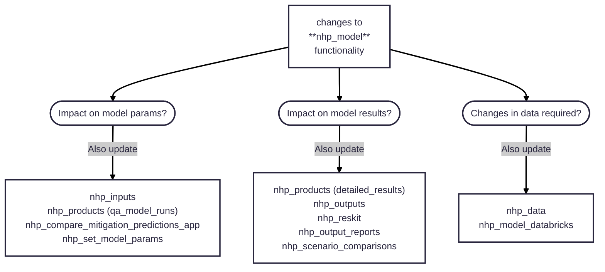
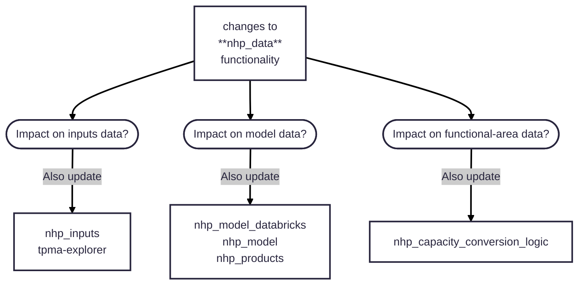

```mermaid
---
config:
  theme: redux
  layout: dagre
  look: classic
---
flowchart TD
    n1["changes to <br>**nhp_model**<br>functionality"] --> n3(["Impact on model params?"]) & n2(["Impact on model results?"]) & n4(["Changes in data required?"])
    n3 -- Also update --> n5["nhp_inputs<br>nhp_products (qa_model_runs)<br>nhp_compare_mitigation_predictions_app<br>nhp_set_model_params"]
    n2 -- Also update --> n6["nhp_products (detailed_results)<br>nhp_outputs<br>nhp_reskit<br>nhp_output_reports<br>nhp_scenario_comparisons"]
    n4 -- Also update --> n7["nhp_data<br>nhp_model_databricks<br>"]
    n1@{ shape: rect}
```

```mermaid
---
config:
  theme: redux
  layout: dagre
  look: classic
---
flowchart TD
    n1["changes to <br>**nhp_data**<br>functionality"] -->  n2(["Impact on inputs data?"]) & n4(["Impact on model data?"]) & n8(["Impact on functional-area data?"])
    n2 -- Also update --> n6["nhp_inputs<br>tpma-explorer<br>"]
    n4 -- Also update --> n7["nhp_model_databricks<br>nhp_model<br> nhp_products"]
    n8 -- Also update --> n9["nhp_capacity_conversion_logic"]
    n1@{ shape: rect}
```
